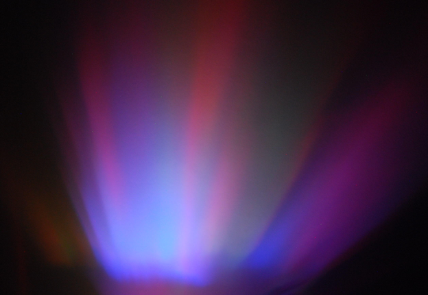
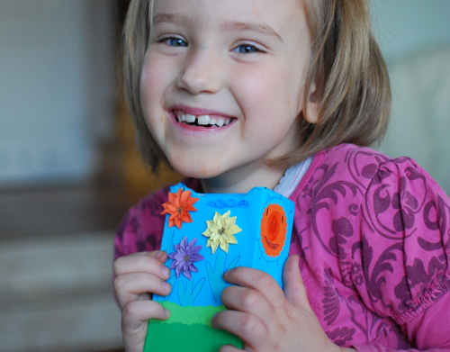

## Aurora lamp based on Arduino



I had this idea in mind for a while, but it took me some time to acually do it.  My child likes when there the room is lit a little during the night. I was thinking about building something which not only will provide light, but will be pretty and constantly changing which would made it fun to watch.  The other requirement was to make it automatically switch on when the lights go off. In theory this supposed to take some pressure of that moment.  Unfortunately his part was only my wishful thinking.  

Lamp independently changes intensity of red, green and blue colors of both LEDs, using the sine function to ease the light changes near the limiting values.

---

## Parts

* Arduino board
* 2 x RGB LEDs
* 6 x 200 Ohms resistors (I should use a different resistance per each color)
* light sensor
* 10kOhm resistor
* a box (i.e. package for iPhone 3GS)
* piece of plastic - old credit/gift card
* kitchen foil, or anything which will reflect the light
* software - https://github.com/zalun/AuroraLamp


---

## Assembly

There was no need for glue - board and parts fit in the box perfectly. I've cut a piece of old hotel card which was slighty wider than the box. I covered it with a kitchen foil to form a mirror.  This doesn't have to be perfect, it's even better if there are some distortions. Then I formed a bow and placed inside the box.


A window needs to be cut to project the reflected light on the wall.


Some decoration made by the target audience made a usable product from the prototype.



---

## Tinkering

If you want - just upload the software and all should be fine. But it is designed to make some changes.

Lamp switches on when the ambient light level is below the value of `BRIGHT`

```const int BRIGHT = 5;```

Speed of the calculations is defined in `STEP` in milliseconds

```const int STEP = 5;```
