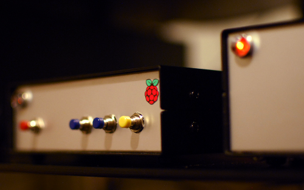
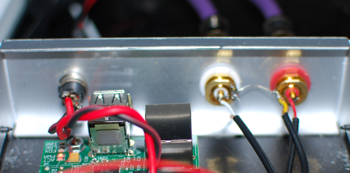

# Network player based on RaspberryPi and Hifiberry

For some time I was thinking about adding a network player to my audio setup.  
I use a turntable for most of the time, but for some use cases it was no good.
Playing background music for programming was no fun. We are also often listen
to the radio and since I found out that Onkyo A-8860 has a way better sound than
three times more expensive Denon AV 1710 I had no radio anymore. I was 
considering buying Mac Mini, but the price is way too high even for the used
devices. I checked for external DACs for RaspberryPi, but there were (are?) 
issues with IO on rPi. Then in December I found Hifiberry - a DAC which is
connected directly to the I2S slot in RaspberryPi. Exactly what I was looking 
for. Non expensive, high quality DIY device. There was some soldering involved 
as I wanted RCA slots in different place and RaspberryPi has no pins in I2S slot.

---

## Requirements

### Plays music

After some research on Linux distribution I have chosen Volumio as it uses MPD 
and is advertising as audiophile weapon. It is also working with 
Hifiberry with almost no changes. I was surprised it runs ``shairport`` which 
allows to stream from any Apple device.

### Radio Player

I often listen to "Trójka" Polish radio station. Unfortunately it uses some
strange codec and is not working under MPD. I decided to use Mplayer to play
internet radio.

### Test files

What's the fun of owning a DIY network player if one can't take it and test how
it sound on your friend's system? I have some space on SD where I copied few
files. No need to connect to the probably unsafe local network.

---

## Logic

Device has four buttons. Stop / Radio / Music / Test

If this logic works for you as well feel free to download the software from
https://github.com/zalun/NetPlayer

I made a choice to not switch off the device on a usual basis, I can always
run ssh and ``halt`` it from the terminal.

### Stop

This is stop and restart button. I stop all clients and restart ``shairport``.
I wanted it that way to be sure everything has stopped playing even if it
wasn't run by pressing a button.

### Radio

Stations are defined in ``settings.py``. Depending on the current state pressing 
the button is either switching lates played station or switching to the next 
one on the list.

### Music

Play current song or switch to the next one in playlist.

Note: One needs to create a playlist using an MPD client on a different device.

### Test

Files are read from the directory specified in ``settings.py``. Again - Play
current song or switch to the next one.

---

## Build

Hearing that the standard impulse power source isn't good for sound I bought
a good quality assembled DIY power source. I've placed it in a separate box as
I might use it to power another device. The NetPlayer has power input and RCA
output. It connects to the network using WiFi USB dongle. All music files are
copied to the Synology NAS. Boxes used aren't pretty yet, also the buttons are
temporary. I want to design front panel with wooded buttons. There is also an 
idea to add display (LED or OLED).

First I've designed the device using a prototype board. After it worked well
for a week or so, I've ordered the boxes.

It does look well on the shelf even with the current design.

