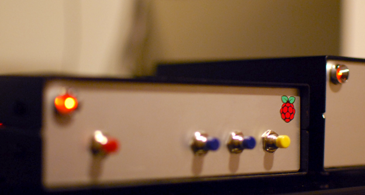

## <% this.get('title') %>



I use a turntable most of the time, but sometimes using it is just a hassle. Getting up every 20 minutes to play music while working is no fun. Another need expressed by Gosia is an internet radio. I researched external DACs for RaspberryPi, but there was (is?) an issue with IO on rPi. I was even considering to buy a Mac Mini, but the price is way too high even for the used devices. Then I found <a href="http://www.hifiberry.com/" target="_blank">Hifiberry</a> - a DAC capable of playing 192kHz/24bit which connects directly to the I2S slot in RaspberryPi.  Exactly what I was looking for. Non expensive (the all together cost including shipping, case and all parts was about 80GBP), high quality DIY device. And, believe me, it does work well with an amplifier from the 90's.

---

## Requirements

### Plays from a playlist

After doing some research on the Linux distribution I have chosen <a href="http://volumio.org/" target="_blank">Volumio</a> as it uses <a href="http://www.musicpd.org/" target="_blank">MPD</a> and is advertising as a weapon for audiophiles. Volumio is also working with Hifiberry almost out of the box. It was a pleasant surprise to find it running ``shairport``, a server to stream from Apple devices.

### Plays Internet Radio

We often listen to "Trójka", a known Polish public radio station. Unfortunately it uses some strange codec which makes it unplayable under MPD. I've decided to use <a href="http://mplayerhq.hu" target="_blank">Mplayer</a> instead.

### Plays music test files

What's the fun of owning a DIY network player if you can't take it and test how it sounds on your friend's system? I have some space on SD where I've copied a few files. No need to connect to the (possibly unsafe) local network.

---

## Logic


The device has four buttons. ``stop`` / ``radio`` / ``music`` / ``test``

If this works for you as well, feel free to download the software from https://github.com/zalun/NetPlayer.

<blockquote>I've made a choice not to switch off the device at a usual basis, I can always run <i>ssh</i> and <i>halt</i> it from the terminal. This however might change in the future, as I'm considering adding a button on the back panel.</blockquote>

### Stop

Stops all music playing clients and restarts ``shAirport``. Stops everything even if it hasn't been run by pressing a button.

### Radio

Stations are defined in ``settings.py``. Depending on the current state pressing the button is either playing latest played station or switching to the next one on the list.

### Music

Plays current song or switches to the next one in the playlist. Note that this assumes that a playlist has been created using an MPD client on a different device.

### Test

Files are read from the directory specified in ``settings.py``. Again - Plays current song or switches to the next one.

---

## Build


Hearing that the standard impulse power source isn't so good for sound I bought a good quality DIY, but preassembled power source. I've placed it in a separate box as I might want to use it to power another device. The NetPlayer has power input and RCA output. It connects to the network using WiFi USB dongle. All music files are copied to the Synology NAS. Boxes used aren't pretty yet, also the buttons are temporary. In the future I will design the front panel with wooded buttons. There is also an idea to add display (LED or OLED).


First I've built a prototype using a prototype board. After it worked well for a week or so, I've ordered the boxes (I bought the cheapest from <a href="http://modushop.pl/" target="_blank">Modushop</a> for about &pound;10 each).


---

## Software installation

* <a href="http://www.hifiberry.com/guides/setting-up-volumio-to-get-great-audio/" target="_blank">Volumio</a> (contains Hifiberry hardware building information)
* Mplayer 

  ```sudo apt-get install mplayer``` 

* Git 

  ```sudo apt-get install git git-client```

* Install Python

  ```sudo apt-get install python-pip python-dev build-essential
sudo pip install --upgrade pip 
sudo pip install -g RPi.GPIO```

* Listen to buttons 

  ```cd ~volumio
git clone git@github.com:zalun/NetPlayer.git ```

  To run the listener one needs to call 

  ```cd ~volumio
sudo python -m NetPlayer.listen```
