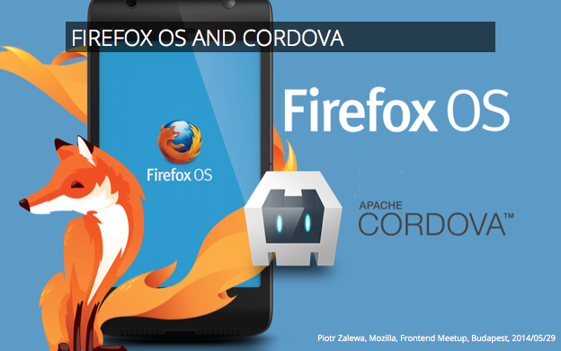
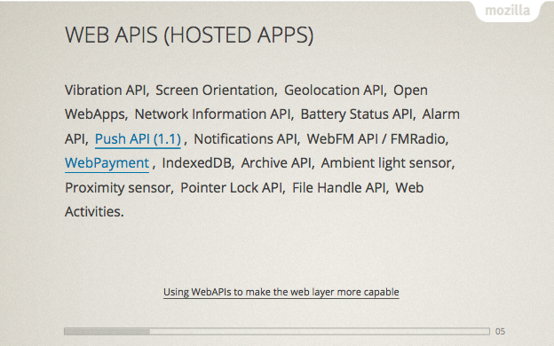
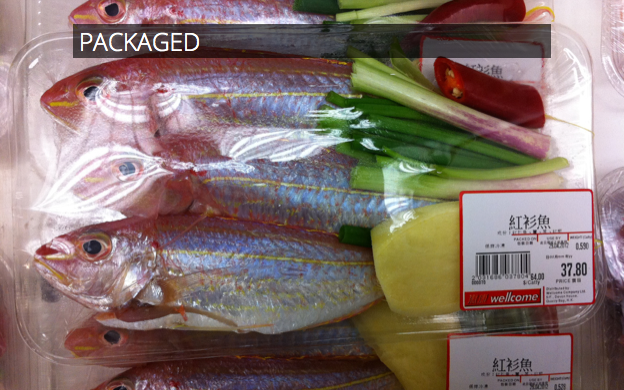
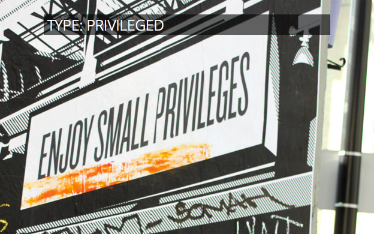
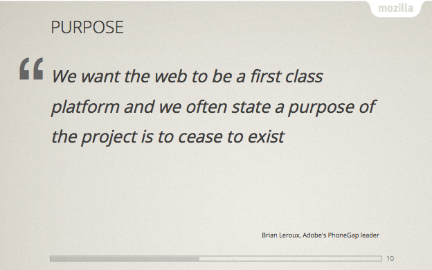
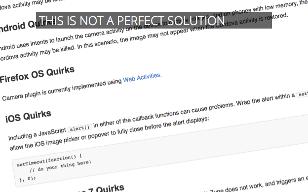
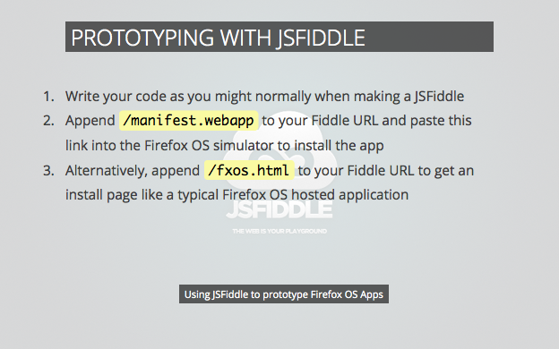
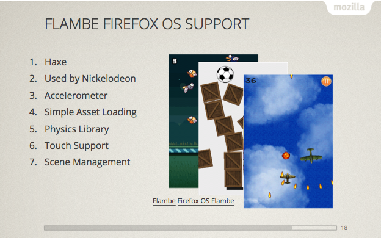

## <% this.get('title') %>

<a href="https://developer.mozilla.org/en-US/Apps/Quickstart/Build/Intro_to_open_web_apps" target="_blank">MDN - Intro to Open Web Apps</a> 

Given that webapps are web sites with a manifest, here is what it looks like. 
<a href="https://developer.mozilla.org/en-US/docs/Apps/Manifest" target="_blank">MDN - Manifest</a>

There are few types of apps. One of these is *hosted* apps. Technically that is an HTML on the web whith a manifest and install page. This gives the developer an ability to provide an app to users without having it updated to Marketplace. <a href="https://developer.mozilla.org/en-US/Marketplace/Options/Hosted_apps" target="_blank">MDN - Hosted Apps</a>

This solution limits the APIs which might be used. The list above might not be actual. <a href="https://hacks.mozilla.org/2013/02/using-webapis-to-make-the-web-layer-more-capable/" target="_blank">Using WebAPIs to make the web layer more capable</a>.

Packaged app might be simply a hosted app packed using zip. This can be uploaded to Marketplace reviewed and downloaded by users. There is some access to the device which hosted apps don't have - in example Gallery. <a href="https://developer.mozilla.org/en-US/Marketplace/Options/Packaged_apps" target="_blank">MDN - Packaged apps</a>, <a href="https://developer.mozilla.org/en-US/Marketplace/Options/Packaged_or_hosted_" target="_blank">Packaged or hosted?</a>

Privileged apps are made by adding ``"type": "privileged"`` to the app manifest. These apps are a subject of <a href="https://developer.mozilla.org/en-US/Apps/CSP" target="_blank">Content Security Protection</a> which limits the way one writes an app. The only real consideration is that inline JavaScript is forbidden. Place all JavaScript in a separate file. Isn't this a good practice anyway?

Privileged apps have access to more APIs. And there is more to come!

<a href="http://cordova.apache.org/" target="_blank">Apache Cordova</a> is a platform for building native mobile applications using HTML5. It is used by many projects like <a href="http://phonegap.com/" blank="_blank">PhoneGap</a> or <a href="http://ionicframework.com/" target="_blank">Ionic</a> which expand it's features.

The purpose is HTML5 to become de facto platform for writing web apps.

Cordova is not perfect, there are differences in implementation of the APIs across platforms. Writing an advanced app using few APIs might not be exactly ``cordova build ios firefoxos``, there would be some additional work to prepare it to work on all desired platforms.

Create and prepare an app using geolocation.

I've shown a demo where I created an app rand un it.

A continuation of the demo above including a presentation of App Manager debugging and editing features.

<a href="http://mozilla.github.io/brick/" target="_blank">Brick</a> is based on X-Tags. It's a set of UI tools (flipbox, calendar, etc.) which make work on HTML5 an easy task.

<a href="http://jsfiddle.net" target="_blank">JSFiddle</a> is a sandbox for developers. Creating a simple HTML5 example is very straight forward. After saving it add ``/manifest.webapp`` to given URL and you can install it in App Manager.

There are others cross platform tools to create webapps. Some of them, like <a href="https://github.com/aduros/flambe" target="_blank">Flambe</a> are for creating games. 

Flambe uses Haxe a language created for making games. It has built in support for physics. It is used by Nickelodeon and others.

Please take a look at our site at <a href="http://mozilla-cordova.github.io/" target="_blank">our GitHub page</a> to current status of the implementation and information how to participate.

We do update the information about the plugins development.

